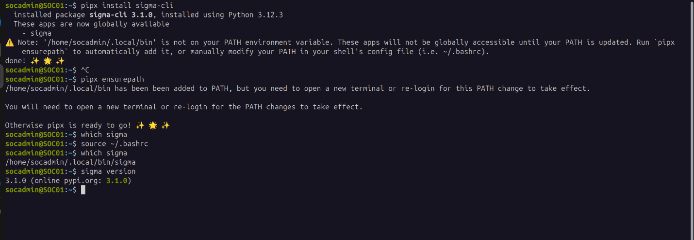
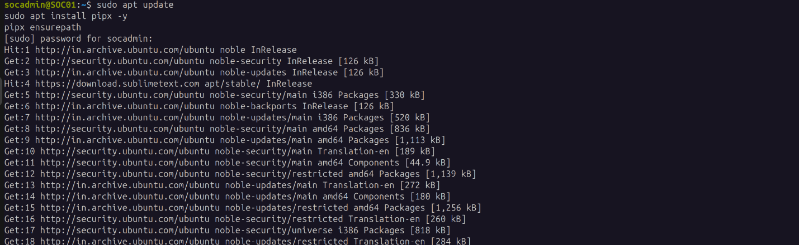
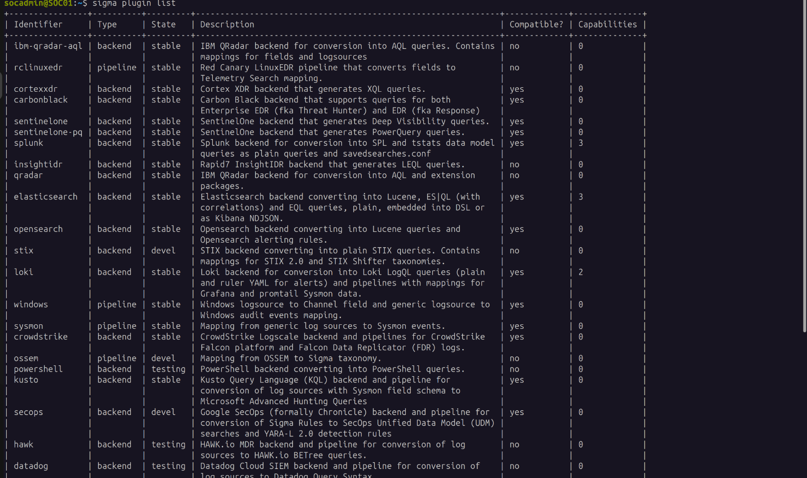
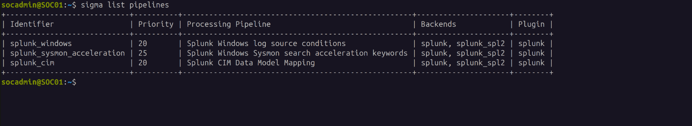

# Sigma CLI Setup

**Status:** Complete
**Lab:** Splunk Detection Engineering Lab
**Updated:** 2026-07-17

Sigma rules need a converter to become the actual SPL that runs in Splunk. This is that tool, installed on SOC01 alongside the rules themselves — not on WIN10-01, since rule development and conversion happen on the SOC side, not the endpoint being monitored.

## Prerequisites

```bash
python3 --version
```
Python 3.9+ required.

## Install pipx

`pip install --user` works, but `pipx` isolates CLI tools in their own environment instead of polluting the system Python — the right way to install a standalone tool like this rather than a project dependency.

```bash
sudo apt update
sudo apt install pipx -y
pipx ensurepath
```

Restart the terminal after this — `ensurepath` writes the PATH change to your shell config, but it doesn't take effect in the current session. Skipping the restart is what causes the PATH issue below.

## Install Sigma CLI

```bash
pipx install sigma-cli
```

If `pipx` isn't available for some reason, `python3 -m pip install sigma-cli` works as a fallback, but loses the isolation benefit above.

## Install the Splunk backend

Sigma CLI doesn't ship with backend converters built in — each target (Splunk, Elastic, etc.) is a separate plugin.

```bash
sigma plugin install splunk
```

Verify:
```bash
sigma plugin list
```
```
splunk      backend     stable
```






## Verify available pipelines

A backend converts Sigma's generic field logic into a target query language; a **pipeline** is what maps that generic logic onto a *specific* log source's actual field names and structure (e.g., Sysmon's field names vs a generic Windows TA's). Without the right pipeline, the conversion runs but produces a query with fields that don't exist in your data.

```bash
sigma list pipelines
```
Confirmed `splunk_windows` is available among the listed pipelines — this is the one used for converting rules against this lab's Windows telemetry.



## Troubleshooting — PATH not found after install

First attempt to run `sigma` after installing failed silently in the sense that the command wasn't found at all, despite the install reporting success. Root cause: `pipx ensurepath` had updated the shell config, but the current terminal session was still using the old PATH from before that change.

**Fix:**
```bash
pipx ensurepath
source ~/.bashrc
```
Or, more reliably: just close the terminal and open a new one — `source`-ing the rc file manually works in most cases but doesn't always pick up every change `ensurepath` makes, depending on shell setup.

Verified the fix actually worked before moving on, rather than assuming:
```bash
which sigma
```
```
/home/socadmin/.local/bin/sigma
```

```bash
sigma version
```

## Writing and converting a rule

Save a rule as a `.yml` file:

```bash
nano my_rule.yml
```
Paste the rule content, then `Ctrl+O` to save, `Ctrl+X` to exit.

Validate it before converting — catching a malformed rule at the check stage is faster than debugging a bad SPL conversion later:

```bash
sigma check my_rule.yml
```

Convert — **this specific command targets Splunk.** Sigma supports dozens of other SIEM/backend targets (Elastic, QRadar, Microsoft Sentinel, and more) through the same `sigma-cli` tool, just with a different `-t` value and its own backend plugin installed first. The full list of supported backends, and how to install each one, is on Sigma's own docs: [sigmahq.io/docs/digging-deeper/backends](https://sigmahq.io/docs/digging-deeper/backends).

```bash
sigma convert \
  -t splunk \
  -p splunk_windows \
  my_rule.yml
```

## Output formats — plain query vs. saved search

The Splunk backend supports two output formats, not just one:

**`default`** — a plain SPL query, printed to the terminal (or a file). This is what every command in this doc has used so far. Good for running a search manually or copy-pasting into Splunk's search bar to verify results before committing to anything more permanent.

```bash
sigma convert -t splunk -p splunk_windows my_rule.yml
```

**`savedsearches`** — outputs a Splunk `savedsearches.conf` file, ready to drop into an app's `local/` directory as an actual saved search or alert, rather than a query you paste in by hand each time:

```bash
sigma convert -t splunk -f savedsearches -p splunk_windows -o my_rule_savedsearches.conf my_rule.yml
```

List every format a given backend supports before assuming `default` is the only option:
```bash
sigma list formats splunk
```

**On "Uncoder"** — Uncoder (from SOC Prime) is a real tool for the same general purpose, but it's a separate third-party product, not an output format or feature of `sigma-cli` itself. It's a web-based/AI-assisted converter with its own interface, useful if you want a GUI rather than a terminal workflow, but it's not part of the setup covered in this doc. Worth knowing it exists, not worth conflating with the two format options above.

## What the converter does and doesn't handle

`splunk_windows` correctly maps Sigma's field-level logic to Splunk syntax and applies the right operators — but it has no knowledge of environment-specific choices, like this lab's decision to split telemetry into `sysmon`, `wineventlog`, and `powershell` indexes instead of a single default index. The converter's output needs an `index=` clause added manually, and its boolean grouping should be double-checked rather than trusted blindly — a converted rule with a nested OR/AND structure can come out without the parentheses needed to preserve the original logic. Both of these are covered with a concrete example in `06-atomic-red-team.md`'s companion investigation notes, where a converted rule initially returned zero results because of the missing index scope.

**A converted query returning zero results — or worse, silently returning the wrong results — isn't always the index.** The pipeline's field mapping is built against a *generic* assumption of how a field is named and populated; this lab's actual data doesn't always match that assumption exactly (custom index layout being one example already documented, but not the only possible one). Before trusting a converted SPL query as correct, re-check it against fields actually present in this environment — `| fieldsummary` or a quick `| table <fields>` on a known-good event is enough to confirm a field name or value format the pipeline assumed actually matches what's really being indexed here, rather than assuming a clean conversion with no errors means a semantically correct query.

## Where this leaves things

Sigma CLI is installed on SOC01, the Splunk backend and `splunk_windows` pipeline are confirmed working, and the PATH issue that blocked the first install attempt is understood and resolved rather than worked around. Every rule going forward gets checked with `sigma check` before being trusted, and every converted SPL query gets manually reviewed for index scoping and grouping before being treated as equivalent to the original rule — not assumed correct just because the converter ran without an error.

## Used by

This is a one-time environment setup, referenced by every technique that needs to convert a
Sigma rule to SPL rather than repeated per-technique:

- [`detections/T1059.001-encoded-powershell-via-cmd/05-evidence.md`](../detections/T1059.001-encoded-powershell-via-cmd/05-evidence.md) — first technique to use this setup, includes the rule-specific `sigma check` / `sigma convert` run.
